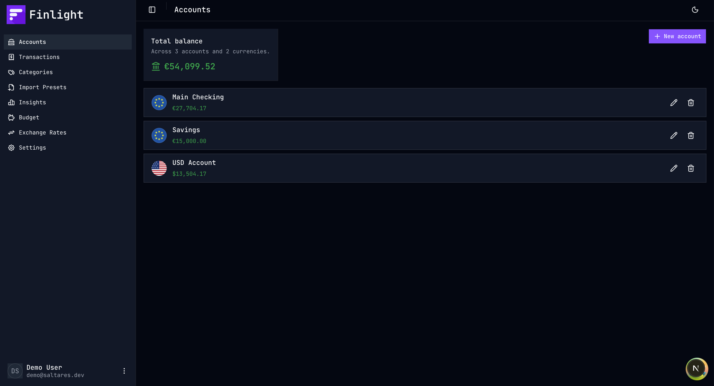
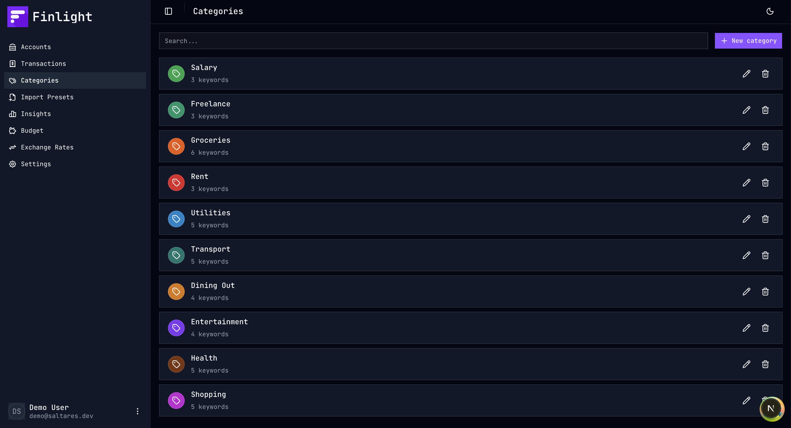
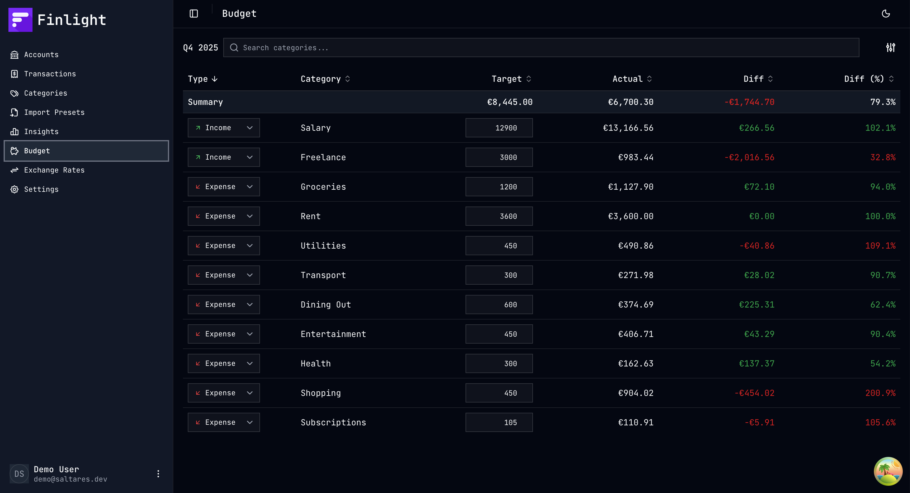
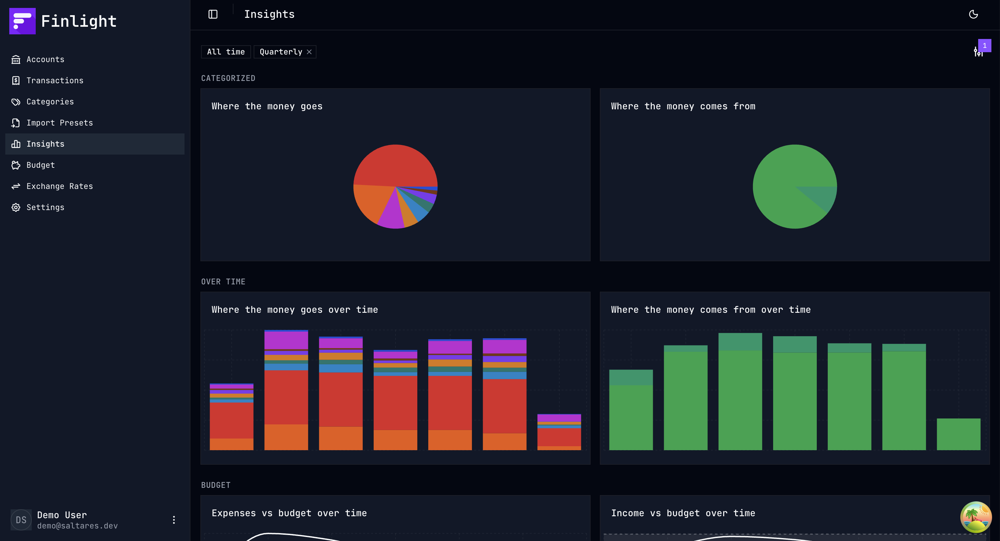
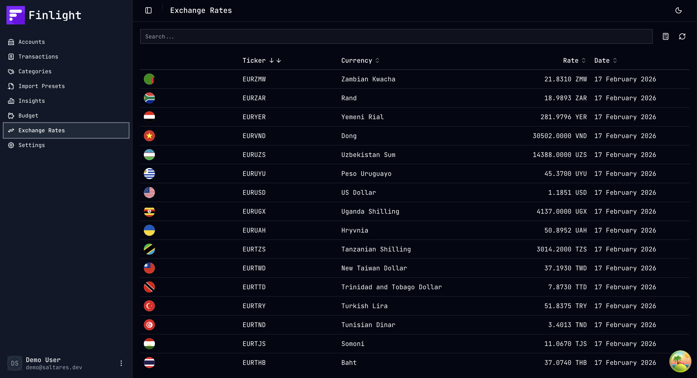

# 💰 Finlight

Self-hosted personal finance tracker. Manage accounts, categorize transactions, set budgets, and visualize spending with interactive reports.

## ✨ Features

- 🏦 **Accounts** — multi-currency bank account tracking
- 📊 **Transactions** — CSV import with configurable presets, bulk operations
- 🏷️ **Categories** — organize income & expenses
- 📈 **Insights** — 9 report types (category breakdowns, over-time trends, budget vs actuals, balance forecasts)
- 💵 **Budget** — per-category targets with granularity scaling (monthly/quarterly/yearly)
- 💱 **Exchange rates** — automatic currency conversion
- 🔐 **Auth** — Google OAuth via Better Auth

## 📸 Screenshots

| | |
|---|---|
|  |  |
|  |  |
|  |  |

## 🛠️ Tech Stack

- ⚡ **Next.js 16** — App Router, React 19, TypeScript
- 🔗 **tRPC 11** — end-to-end typesafe API
- 🗄️ **Kysely + SQLite** — type-safe query builder with better-sqlite3
- 📦 **TanStack Query 5** — server state management
- 🔐 **Better Auth** — Google OAuth authentication
- 🎨 **Tailwind CSS 4 + shadcn/ui** — styling & components
- 📊 **Recharts** — interactive charts
- ✅ **Zod 4** — schema validation
- 🧹 **Biome** — linting & formatting

## 🚀 Development

```bash
cp .env.example .env   # fill in secrets
yarn install
yarn migrate
yarn dev               # http://localhost:3010
```

| Command | Description |
|---------|-------------|
| `yarn dev` | Dev server (port 3010) |
| `yarn build` | Production build |
| `yarn lint` | Biome check |
| `yarn format` | Biome format |
| `yarn migrate` | Run DB migrations |
| `yarn gen-types` | Regenerate Kysely types |

## 🐳 Docker

A `docker-compose.yml` is included for quick self-hosting.

```bash
cp .env.example .env   # fill in BETTER_AUTH_SECRET, BETTER_AUTH_URL, GOOGLE_CLIENT_ID, GOOGLE_CLIENT_SECRET
docker compose up -d
```

Data is persisted in a `finlight-data` volume at `/data/db.sqlite`. The image is available at `ghcr.io/dsaltares/finlight:main`.
